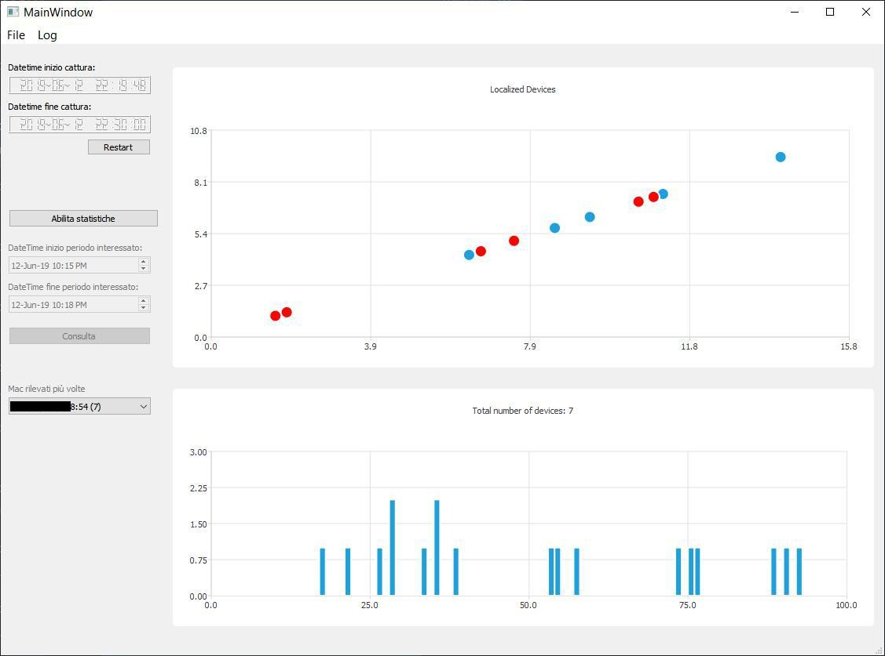

# GUI

## Upper chart
The upper chart shows discovered devices in real time. Some devices use their real MAC address when sending probe requests (blue ones) while others use the MAC randomization technique in an attempt to protect privacy (red ones).

## Lower chart 

The lower chart shows in each 3-second interval within last 5 minutes (i.e. 100 intervals) how many devices were detected.

## Controls 

In the left column, top-down, there is:
- the start and the end of capturing time;
- statistics-mode controls which allows to interrogate the database at any point in time;
- the list with the most detected MACs (top 10) within the last 5 minutes if in real time, and within the selected time interval in statistics mode.

